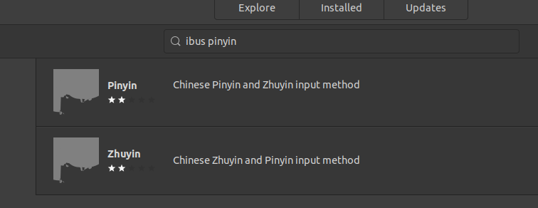

- [前言](#前言)
- [原始教程](#原始教程)
  - [第一步: 确保安装了ibus和iBus preferences](#第一步-确保安装了ibus和ibus-preferences)
  - [第二步：安装 ibus pinyin](#第二步安装-ibus-pinyin)
  - [第三步，在ibus-setup中添加智能拼音Chinese-intelligent Pinyin输入法](#第三步在ibus-setup中添加智能拼音chinese-intelligent-pinyin输入法)
  - [第四步：在Ubuntu的区域与语言设置里添加中文](#第四步在ubuntu的区域与语言设置里添加中文)
- [后续更新内容](#后续更新内容)
  - [VS Code下不能输入中文的bug解决方法](#vs-code下不能输入中文的bug解决方法)

## 前言

每一次搜索如何在Ubuntu上安装拼音输入法都让我十分头疼，年久失修的软件包和失灵时不灵的StackOverflow答案更是让人沮丧。折腾了一番在这里记录以下，即是为了自己，也是为了让更多的中文使用者在完全迁移至Ubuntu的时候少一份顾虑。

在Ubuntu上使用中文输入法有很多种方法，在这里我提供一种解决方法并且确保它的简介和有效性。我可以确认下述方法的有效性因为我正在使用它撰写本文。对于不愿意折腾的人，其实Chrome的[Google Input Tools](https://chrome.google.com/webstore/detail/google-input-tools/mclkkofklkfljcocdinagocijmpgbhab?hl=en)插件已经提供了浏览器内中文输入的解决方案，可以考虑。如果你确实需要全局的中文输入法，请继续阅读。

## 原始教程

### 第一步: 确保安装了ibus和iBus preferences

Ubuntu 20.04 自带了**ibus**. 在terminal里输入

```shell
man ibus
```
会告诉你下面的信息。

```shell
IBus is an Intelligent Input Bus. It is a new input framework for Linux
OS. It provides full featured and user friendly input method user in‐
terface. It also may help developers to develop input method easily.
ibus is a command line utility which can restart or exit ibus-daemon,
get or set the current ibus engine or list the ibus engines.
Homepage: [https://github.com/ibus/ibus/wiki](https://github.com/ibus/ibus/wiki)
```

打开Ubuntu Software, 搜索 iBus Preferences, 第一个选项就是iBus Preferences, 如果没有安装，安装它。


安装完成后，可以在terminal里使用 **ibus-setup** 命令，打开ibus设置的图形界面如下图。


### 第二步：安装 ibus pinyin

在Ubuntu Software里搜索 **ibus pinyin** ， 安装第一个结果（得分两星 as January 2021) 。



点进去看如下图。在有些评论里已经指明了正确的使用方法但是无奈没有图示，对新手依然不友好。


### 第三步，在ibus-setup中添加智能拼音Chinese-intelligent Pinyin输入法

打开 **ibus-setup**的图形界面。

在**Input Method**板块下选择**add**添加新语言。点击新弹窗下方的省略号展开所有语言选项将会看到**Chinese**选项。


点击**Chinese**可以找到两个新安装的输入法，选择**Intelligent Pinyin**.


安装完毕后可以在Input Method列表里看到**Chinese-Intelligent Pinyin**选项。如上图的背景部分所示。

### 第四步：在Ubuntu的区域与语言设置里添加中文

打开Ubuntu的设置，找到区域与语言设置。


点击加号+添加输入源。展开列表，点击**Others**选项。


不要检索，滚动到Chinese部分，你可以看到新安装的两个输入法，选择智能拼音输入法即可。


使用Super（对应Windows下的开始按键）和空格键就可以在中英文输入法之间自由切换了。

## 后续更新内容

### VS Code下不能输入中文的bug解决方法

2021年1月16日发现，如果你是通过20.04下的Ubuntu software下载的VS Code 则可能会面对无法在VS Code中输入中文的情况。解决方法是卸载VS Code 然后安装原始的VS Code deb 文件。下载，然后

```bash
sudo apt install code_版本号.deb
```

[Ubuntu - IBus not working on Visual Studio Code](https://sung.codes/blog/2020/09/03/i-bus-not-working-on-visual-studio-code/)